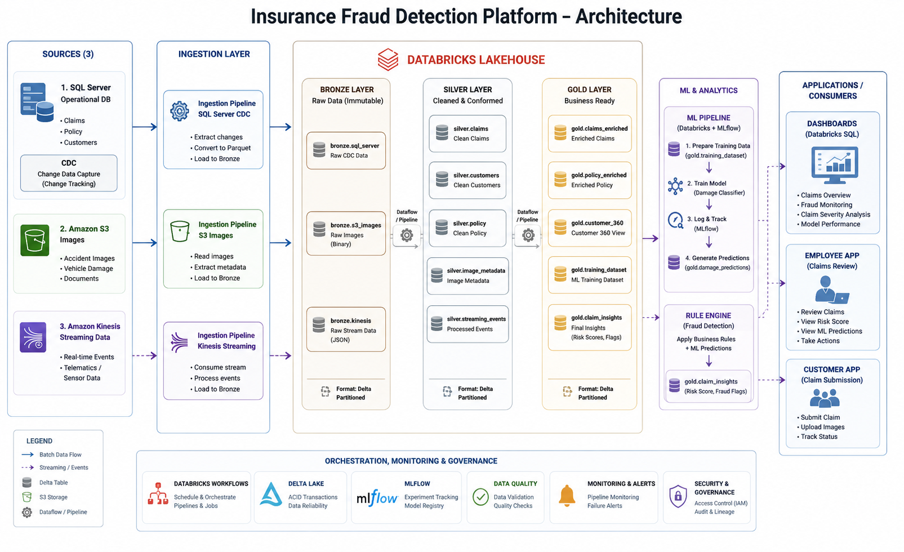

# Insurance Fraud Detection Platform

End-to-end Insurance Claims Lakehouse Platform built on AWS, Databricks, Delta Lake, MLflow, and Python.

This project demonstrates how a modern insurance company can ingest operational, image, and streaming data into a Lakehouse architecture, apply machine learning for damage classification, generate fraud risk scores, and provide curated datasets for analytics and downstream applications.

---

## Architecture



---

## Business Problem

Insurance companies receive claim submissions from multiple systems:

- Policy and customer information stored in operational databases
- Accident images uploaded by customers
- Vehicle telematics and sensor events generated in real time

Processing these data sources independently creates data silos and limits fraud detection capabilities.

This project centralizes all claim-related data into a Databricks Lakehouse platform and applies machine learning and business rules to identify potentially fraudulent claims.

---

## Technology Stack

### Cloud & Storage

- AWS S3
- AWS Kinesis (streaming design)
- Delta Lake

### Data Platform

- Databricks
- Unity Catalog
- Databricks Workflows

### Data Engineering

- Python
- PySpark
- SQL Server CDC
- Change Tracking
- Delta Tables

### Machine Learning

- Scikit-Learn
- MLflow
- Image Classification

### DevOps

- Git
- GitHub Actions
- Ruff
- Pytest

---

## Data Sources

### 1. SQL Server (Operational Database)

Contains:

- Customers
- Policies
- Claims

Change Data Capture (CDC) and Change Tracking are enabled to support incremental ingestion.

### 2. Amazon S3

Stores:

- Accident Images
- Training Images
- Image Metadata

### 3. Amazon Kinesis (Streaming Design)

Vehicle telematics and sensor events:

- Speed
- GPS Coordinates
- Event Timestamps

For portfolio cost optimization, parquet files were used to simulate Kinesis streams while maintaining production-ready ingestion code.

---

## Lakehouse Architecture

### Bronze Layer

Raw immutable data.

Tables:

- bronze.customers
- bronze.policy
- bronze.claims
- bronze.telematics
- bronze.accident_images
- bronze.training_images
- bronze.image_metadata

### Silver Layer

Cleaned and standardized data.

Transformations include:

- Type standardization
- Date parsing
- Data quality validation
- Metadata enrichment
- Image labeling extraction

Tables:

- silver.customers
- silver.policy
- silver.claims
- silver.telematics
- silver.accident_images
- silver.training_images
- silver.image_metadata

### Gold Layer

Business-ready datasets.

Tables:

- gold.aggregated_telematics
- gold.customer_policy_claims
- gold.claims_enriched
- gold.claims_dashboard_summary
- gold.training_dataset
- gold.damage_predictions
- gold.claim_insights

---

## Machine Learning Pipeline

### Training Dataset

A curated training dataset is created from labeled accident images.

Damage categories:

- OK
- Minor Damage
- Major Damage

### Damage Classification Model

The model:

1. Reads labeled images from Gold Layer
2. Converts image binaries into machine-learning features
3. Trains a multiclass classifier
4. Tracks experiments in MLflow
5. Generates predictions and confidence scores

Prediction results are stored in:

```sql
gold.damage_predictions
```

### MLflow Tracking

The platform uses MLflow to:

- Track experiments
- Log metrics
- Store trained models
- Compare model versions

---

## Fraud Detection Rule Engine

Machine learning predictions are combined with business rules.

Example rules:

- High vehicle speed before incident
- Suspicious activity flag
- High claim amount
- Damage severity mismatch
- Low prediction confidence

The engine generates:

- Risk Score
- Risk Level
- Recommended Action

Output table:

```sql
gold.claim_insights
```

---

## Dashboards

Databricks SQL dashboards provide:

- Claims Overview
- Fraud Monitoring
- Severity Analysis
- Claim Trends
- Model Performance Metrics

---

## Application Layer

The architecture supports two downstream applications.

### Customer Portal

Customers can:

- Submit Claims
- Upload Accident Images
- Track Claim Status

### Claims Adjuster Portal

Claims employees can:

- Review Claims
- View Fraud Risk Scores
- Review ML Predictions
- Escalate High-Risk Claims

---

## Data Pipelines

### SQL Server → Bronze

```text
SQL Server CDC
    ↓
PySpark Ingestion
    ↓
Bronze Layer
```

### S3 Images → Bronze

```text
Amazon S3
    ↓
Binary File Ingestion
    ↓
Bronze Layer
```

### Kinesis → Bronze

```text
Kinesis Stream
    ↓
Structured Streaming
    ↓
Bronze Layer
```

### Bronze → Silver

```text
Raw Data
    ↓
Data Quality & Standardization
    ↓
Silver Layer
```

### Silver → Gold

```text
Business Logic
    ↓
Joins & Aggregations
    ↓
Gold Layer
```

---

## Orchestration

Databricks Workflows orchestrate:

- Bronze ingestion jobs
- Silver transformation jobs
- Gold transformation jobs
- ML pipelines

All workflows are scheduled and monitored through Databricks.

---

## CI/CD

GitHub Actions pipeline automatically performs:

- Dependency installation
- Ruff linting
- Pytest execution

```yaml
ruff check .
python -m pytest -q
```

---

## Project Structure

```text
insurance-fraud-detection-platform
│
├── architecture/
├── configs/
├── docs/
├── ml/
├── src/
│   ├── ingestion/
│   └── transformation/
├── tests/
├── requirements.txt
└── README.md
```

---

## Future Enhancements

- Real-time Kinesis deployment
- Deep Learning image classification
- Customer claims portal UI
- Claims adjuster portal UI
- Automated model retraining
- Model Registry deployment workflow

---

## Author

Built as a portfolio project demonstrating modern Data Engineering, Lakehouse Architecture, Machine Learning, and Fraud Detection workflows using Databricks and AWS.